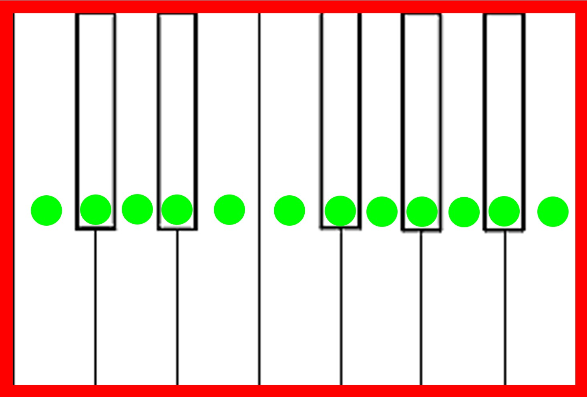

# Paper Piano



**Paper Piano** is an interactive application that lets you “play” a printed piano using green markers and your computer’s camera. It combines OpenCV for computer vision, MediaPipe Hands for finger tracking, and Pygame for sound playback. Perfect for demos, tangible interface prototypes, and digital art projects.

---

## 📖 Overview

1. **Green Marker Detection**  
   - Fine-tune detection with an **HSV Adjust** window featuring six sliders (Hmin/Smin/Vmin | Hmax/Smax/Vmax).  
   - Three built-in presets: Dark Green, Medium Green, and Light Green.

2. **Perspective Transformation**  
   - Click four corners of your printed template to correct the perspective and map the piano in the video feed.

3. **Interaction Modes**  
   - **Dynamic**: continuously redetects marker positions—ideal if you move the sheet.  
   - **Static**: once 12 note markers + 2 control markers are found, their positions freeze and remain constant each frame.

4. **Note Playback**  
   - Sound files located in `Piano_Samples/`:  
     ```
     Piano_Samples/
     ├── C0.mp3 … C7.mp3
     ├── Db0.mp3 … Db7.mp3
     └── … up to B7.mp3
     ```
   - When a tracked fingertip overlaps a note marker, that note plays immediately.

5. **Octave Control**  
   - On-screen buttons (or keyboard shortcuts):
     - Oct– / Oct+  
     - Toggle between 1-octave (12 notes) and 2-octave (24 notes) layouts.  
   - Two large control markers: first = Oct–, second = Oct+. Hover for 0.5 s “cooldown” to switch.

6. **UI and Keyboard Shortcuts**  
   | Button / Key | Action                        |
   |--------------|-------------------------------|
   | Rst / R      | Reset perspective points      |
   | Togl / T     | Toggle static/dynamic mode    |
   | Frnt / F     | Toggle frontal/normal view    |
   | O / P        | Octave Down / Octave Up       |
   | G            | Rotate 180°                   |
   | M            | Mirror horizontally           |
   | N            | Toggle 1 ↔ 2 octaves          |
   | H / J / K    | Apply HSV presets             |
   | Q            | Quit                          |

---

## 📂 Project Structure

```
Paper_Piano/
├── main.py                          # Main application script
├── Piano_Samples/                   # MP3 sound files for each note
│   ├── C0.mp3 … B0.mp3
│   ├── C1.mp3 … B1.mp3
│   └── … up to C7.mp3 … B7.mp3
├── piano_imgs/                      # Template images and documentation
│   ├── Paper Piano_2.jpg            # Template with green markers
│   ├── Paper Piano_3.jpg            # Alternative template
│   └── Paper Piano.docx             # Printable instruction sheet
├── .ipynb_checkpoints/              # Jupyter notebook checkpoints
├── “Paper Piano (2 Octaves).ipynb”  # Demo notebook
├── “Paper Piano (2 Octaves)-…ipynb” # Notebook with alternate controls
├── Paper Piano Demo.mp4             # Full demo video
└── Paper Piano Guide.mp4            # Step-by-step guide video
```

---

## 🚀 Installation & Running

1. **Clone the repository**  
   ```bash
   git clone https://github.com/your-username/Paper_Piano.git
   cd Paper_Piano
   ```

2. **(Optional) Create a virtual environment**  
   ```bash
   python -m venv venv
   source venv/bin/activate     # Linux/macOS
   venv\Scripts\activate      # Windows
   ```

3. **Install dependencies**  
   ```bash
   pip install opencv-python mediapipe pygame numpy
   ```

4. **Run the application**  
   ```bash
   python main.py
   ```

---

## 🎥 Demo Videos

- **Step-by-Step Guide**: [`Paper Piano Guide.mp4`](Paper Piano Guide.mp4)  
- **Full Demonstration**: [`Paper Piano Demo.mp4`](Paper Piano Demo.mp4)  

---

## 🤝 Contributing

1. Fork the repository.  
2. Create a branch: `git checkout -b feature/new-feature`.  
3. Commit your changes: `git commit -m "Add new feature"`.  
4. Open a pull request.  

---

## 📄 License

This project is licensed under the **MIT License**. See [LICENSE](LICENSE) for details.
